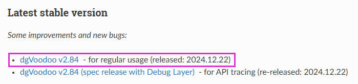
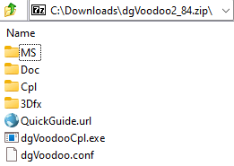

## Use Case
dgVoodoo2 is a rendering API wrapper used to translate games that use older DirectX rendering APIs to newer DirectX Rendering APIs. This is highly useful for adapting older DirectX 8, 9, and 10 games so that they can benifit from ReShade's compute shaders.

---

## Download dgVoodoo2
Download the latest version of dgVoodoo2 from [the developer's website](https://dege.freeweb.hu/dgVoodoo2/dgVoodoo2/#latest-stable-version).

## Navigate to Game Directory
Refer to [our guide on locating your game's directory](../03findgameexecutable).

## Find Game Archtexture and Rendering API
Refer to [PCGamingWiki](https://pcgamingwiki.com/) to determine your game's rendering API and architecture.

## Open dgVoodoo2 Archive
Open your downloaded copy of the dgVoodoo2 Archive using the latest version of [7zip](https://www.7-zip.org/).

Inside, you'll find the `MS`, `Doc`, `Cpl`, and `3Dfx` directories along with three additional files. Navigate to the appropriate folder based on your game's  current rendering API.

