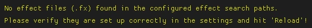

# FiveM

## Use Case
FiveM is a platform that lets you play on custom servers for Grand Theft Auto V (GTAV). To get ReShade working with FiveM, you need to follow specific steps. This guide will show you exactly what to do and provide all the details you need.

---

## Step 1: Turn On Windows File Extensions

To follow this guide properly, you need to be able to see file extensions in Windows. File extensions are the parts at the end of file names that indicate the file type, like `.exe` or `.dll`. Enabling these will help you find and move the right files. Follow our [guide for enabling Windows file extensions](../additionalguides/01enablefileextensions) to complete this step.

## Step 2: Install ReShade to GTAV

Download the latest Add-on Support Build of ReShade from the official ReShade website. Make sure to install it into your GTAV game folder and do not include any add-ons during the process. This is important to prevent issues later. If you need assistance, refer to our [ReShade installation guide](../reshade/installing/01reshadesetuptool). Double-check that the installation was successful before moving forward.

## Step 3: Navigate to your GTAV Folder

Locate your GTAV game folder, where the main game files are stored. If you’re unsure how to find it, use our [guide for finding your game’s executable](../additionalguides/03findgameexecutable). Ensure these files and folder are present:

- `dxgi.dll`
- `reshade.ini`
- `reshade-shaders`

These ReShade files will be needed later. Confirm they are in your GTAV directory.


## Step 4: Navigate to your FiveM Installation

Next, find the folder where FiveM is installed. This is important for transferring files in the next steps. Use the same method from Step 3 to locate your FiveM folder.


## Step 5: Navigate to FiveM's Plugins Directory

Open your FiveM folder and navigate to “FiveM Application Data.” Inside, find and open the “plugins” folder. This is where you will place the ReShade files.


## Step 6: Transfer ReShade Files

Go back to your GTAV folder and cut the following files and folder:

- `dxgi.dll`
- `reshade.ini`
- `reshade-shaders`

Paste these into the "plugins" folder in your FiveM directory. This ensures ReShade will work properly with FiveM.


## Step 7: Press F8 to Check FiveM's Log

Start FiveM and press `F8` on your keyboard to open the console log. This log shows messages and errors that can help you troubleshoot. You should see an error message with instructions related to ReShade. It will look something like this:


Copy everything starting from “[Addons]” to the end of the error message. Paste it into the `CitizenFX.ini` file in your FiveM folder, and replace the example ID with the actual ID from your error log.

```
[Addons]
ReShade5=ID:XXXXXX acknowledged that ReShade 5.x has a bug that will lead to game crashes
```

**Important Note:** Ensure your ID matches the one in the FiveM log exactly. Even a small mistake can prevent this from working.

## Step 8: Restart FiveM and Enable "Fix UI Lag"

After updating the `CitizenFX.ini` file, restart FiveM. Go to the settings menu and enable the “Fix UI Lag” option. This helps with performance and compatibility. Once it’s enabled, restart FiveM one more time to ensure everything is set up correctly.

---

### Common Problems and Solutions

**ReShade “No effect files” error:**

If you see an error that says “No effect files found,” it usually means your `reshade.ini` is broken or there was a setup mistake. To fix this, go to the “Settings” tab in ReShade and set the effect and texture search paths as shown below:

| Search Path                    | Description                |
|--------------------------------|----------------------------|
| .\reshade-shaders\Shaders\\**  | Effect Search Path         |
| .\reshade-shaders\Textures\\** | Texture Search Path        |

These paths tell ReShade where to find its effect files and textures. Make sure you type them exactly as shown to avoid errors.



Follow these steps carefully, and ReShade should work smoothly with FiveM. Good luck, and enjoy your enhanced game visuals!