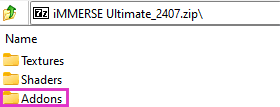
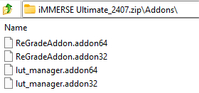

# Marty's Mods Quickstart

## What Marty's Mods Provides
Everything provided under Marty’s public (qUINT, iMMERSE, METEOR) and Patreon repositories (iMMERSE Pro & iMMERSE Ultimate) are shaders for the ReShadeFX shader language. Designed for and applied through the injectable application ReShade. These shaders exist to enhance, define, or drastically change the way that you play your games. Providing the tools that you need in order to cultivate the gameplay experience that you want.

Down the line, there are plan to develop presets that Patreon’s can use, as well as vote on upcoming relases. However, development of shaders is the main priority of the Patreon project, and creation of presets have slowed down.

### iMMERSE
iMMERSE is the core repository of shaders from Marty’s Mods and are available for [free on GitHub](https://github.com/martymcmodding/iMMERSE).

### iMMERSE Pro
iMMERSE Pro is a premium repository of shaders provided by Marty’s Mods, available to [the “Raytracers” tier members from Pascal’s Patreon.](http://www.patreon.com/mcflypg) For $5 USD, you can access this repository.

### iMMERSE Ultimate
iMMERSE Ultimate is an aditional premium repository of shaders and addons provided by Marty’s Mods, available to [the “Pathtracers” tier members from Pascal’s Patreon.](http://www.patreon.com/mcflypg) For $9 USD, you can access this suite, which features:

### METEOR
METEOR is a tertiary repository of shaders developed by Marty and avaliable for [free on GitHub](https://github.com/martymcmodding/METEOR/). This collection includes unique shaders created for specific use cases or shaders that don’t typically belong in a standard repository. Each shader in METEOR serves a particular purpose, offering specialized effects that might not be found elsewhere.

| Shaders              | Description                                                                                           |
| -------------------- | ----------------------------------------------------------------------------------------------------- |
| Chromatic Aberration | An overengineered chromatic aberration shader that simulates lens effects with high accuracy          |
| Film Grain           | Adds realistic film grain or digital sensor noise to your visuals, with various customization options |
| Halftone             | Simulates the halftone printing process, adding a classic print-like texture to your images           |
| Local Laplacian      | Provides local contrast enhancement using a fast implementation of Local Laplacian filtering          |
| Long Exposure        | Simulates long exposure photography by stacking frames over a specified exposure time                 |
| NVSharpen            | A port of Nvidia’s sharpen technique                                                                  |
| Toddyhancer          | A humorous shader highlighting the exaggerated claims of the “revolutionary” Toddyhancer preset       |

## Downloading Process
iMMERSE comes in three different tiers:

| Repository / Tier	| Price & Download                                                                                                                                                        |
| ----------------- | ----------------------------------------------------------------------------------------------------------------------------------------------------------------------- |
| iMMERSE                             | No Purchase Required - [Downloadable on GitHub or through iMMERSE Pro/Ultimate archives on Discord](https://github.com/martymcmodding/iMMERSE)                          |
| iMMERSE Pro - [Raytracers Tier](https://www.patreon.com/mcflypg/membership)       | Purchased on Patreon for 5USD - [Downloadable on Discord only](https://discord.com/channels/494578207505514496/494599998059839498)                                      |
| iMMERSE Ultimate - [Pathtracers Tier](https://www.patreon.com/mcflypg/membership) | Avalible on Patreon for 9USD - [Downloadable on Discord only](https://discord.com/channels/494578207505514496/494599917273350164)                                       |

## Installing Process

### Shaders
All shader archives & repositories follow the same basic install instructions that you can find in [our guide for installing ReShade shaders manually](/reshade/installing/04manualshaderinstall)!

If you are installing iMMERSE Pro or iMMERSE Ultimate shaders, DO NOT install the iMMERSE Repository manually or through the ReShade installer. Doing so will cause duplicates of the iMMERSE base shaders - as they are included with the iMMERSE Pro and Ultimate archives.

### Addons
Since Addons stray a bit from the Shader install procedure they have to be installed differently:

1. Open the iMMERSE Ultimate archive.
2. Open the “Addons” folder within the iMMERSE Ultimate archive.

    

3. Navigate to your game folder where ReShade and the game exectuable exist. If you’re unsure where your game directory is located, please see [our guide on how to locate your game’s executable](/additionalguides/03findgameexecutable) for assistance!
4. Drag and drop the addon files from the iMMERSE Ultimate archive into your game folder.

    