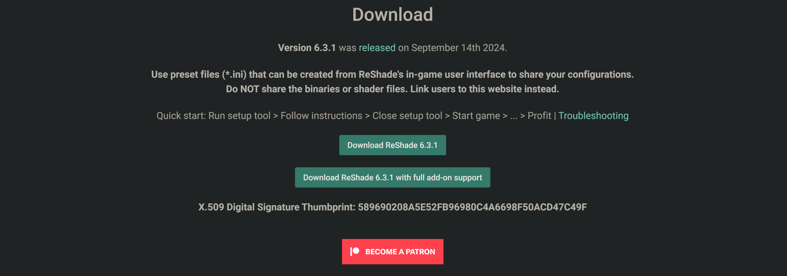

# Downloading ReShade

ReShade is an open-sourced, generic, post-processing tool that allows users to enhance, define, and create the looks that they desire from their game. Being generic, ReShade allows for these modifications through most games available! ReShade has two different builds available for users to download. The Standard and Full Add-on Support build. Below, you can find information specifically on what differentiates the two builds, and the common use cases for them. The latest version of ReShade will always be available at [ReShade's Homepage](https://reshade.me/#download).

---

## Standard ReShade Build (Download ReShade X.X.X)

The Standard Build of ReShade is the most common version. It is ideal for online games with strict anti-cheat mechanisms. This build is used for online games due to its limitations to features, preventing misuse and cheating in online games. If you are unsure of what build to pick, this is likely the best choice!

## Full Add-On Support ReShade Build (Download ReShade X.X.X with full add-on support)

The Full Add-On Support Build of ReShade is best for offline games or games without anti-cheat systems. This build will offer the full feature set and freedom for creating presets with various shaders and add-ons. If your game is offline, it's best to choose this build to prevent issues down the line!

