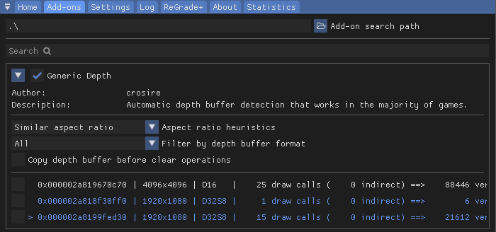

# Add-ons

## Use Case
Each add-on is different, typically providing large enhancements to ReShade that typical shaders cannot perform. By default, "Generic Depth" comes with every installation of ReShade, but you can add many more during the installation process through the ReShade Setup Tool. The "Add-ons" tab helps manage and configure these add-ons after installation.

---

