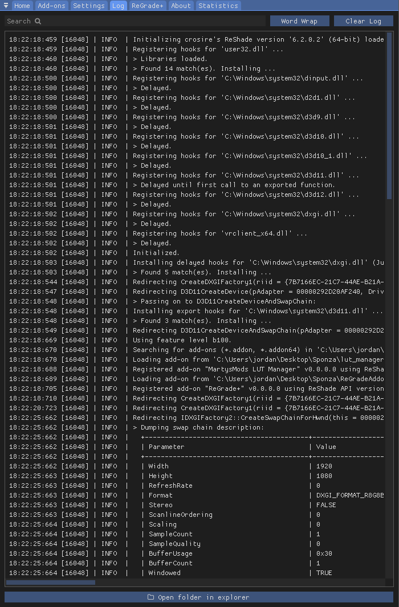

# Log Tab

## Use Case
The "Log" tab contains important information about ReShade’s runtime behavior. It displays errors, warnings, and other messages that may occur during shader loading or runtime.  

If you encounter an issue, it's helpful to share the error messages or the entire log file. Logs are saved in your game's root directory as `ReShade.log`. However, logs are reset each time the game restarts, so make sure to share or save logs before restarting the game.

---

