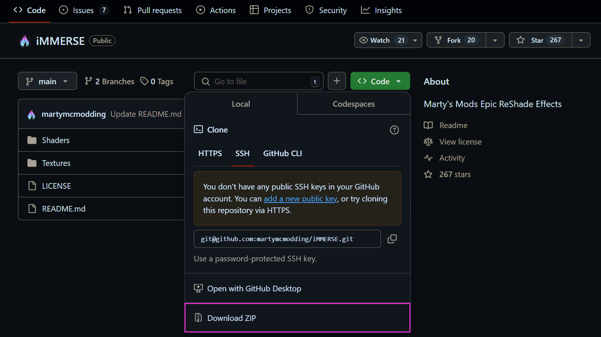

import ReactPlayer from 'react-player'

# Manually Installing Shaders

## Use Case
Sometimes the shader repository that you want to use isn't available with the ReShade Setup Tool. This guide will walk you through the process of installing shaders manually!

:::info
This guide assumes that you already have ReShade installed and working in your game.
:::

---

## Downloading the Shader Repository(s)

This guide will be utilizing the iMMERSE repository on GitHub; however, you can utilize any shader repository for this guide. It's also worth noting that not all shader repositories are hosted the same way. So, it's worth noting that not all shader repositories are hosted the same way. Once you've selected your repository, follow these steps:

It's also worth noting that not all shader repositories are hosted the same way. So your repository might look slightly different.

First, click the "Code" button on GitHub, located toward the top-right area of the repository page.

Once you've clicked the "Code" button, a dropdown menu will appear. Click the "Download ZIP" button from this menu to start downloading your shader repository.

## Installing the Shader Repository(s)

Once the shader repository download is complete, open the ZIP file you downloaded. Extract the contents—typically the "Shaders" and "Textures" folders—directly into your game's "ReShade-Shaders" directory. If Windows warns you about files already existing, simply click "Replace the files in the destination."

<ReactPlayer
  url="https://zarith.us/jordan%5C2025_ZARITH-DESKTOP/c_and_paste_shaders_and_textures_folder.webm"
  playing={true}
  muted={true}
  controls={false}
  loop={true}
  width="100%"
  height="100%"
  style={{ width: "100%", margin: "0 auto" }}
/>

## Setting the Effect and Texture Search Paths

If your ReShade install doesn't detect any new shaders installed, it's best to check the settings tab and verify that your shaders' and textures' paths are set up correctly. These specific options are called "Effect Search Path" and "Texture Search Path."  

These paths should point exactly to the folders you just extracted to. Typically, they should look like this:

| Setting               | Correct Path                     |
|----------------------- | -------------------------------|
| Effect Search Path      | `.\ReShade-Shaders\Shaders\**`  |
| Texture Search Path     | `.\ReShade-Shaders\Textures\**` |

Ensure your paths match these formats precisely to ensure ReShade correctly loads your manually installed shaders.