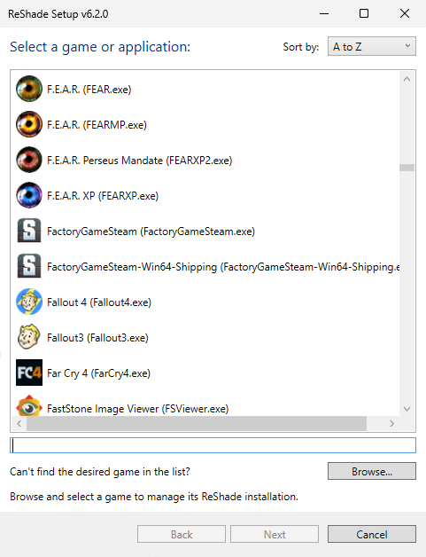
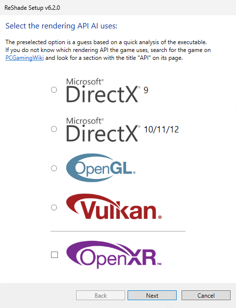
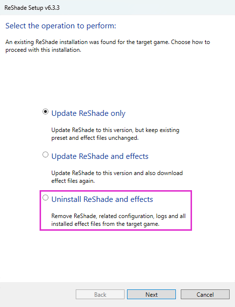
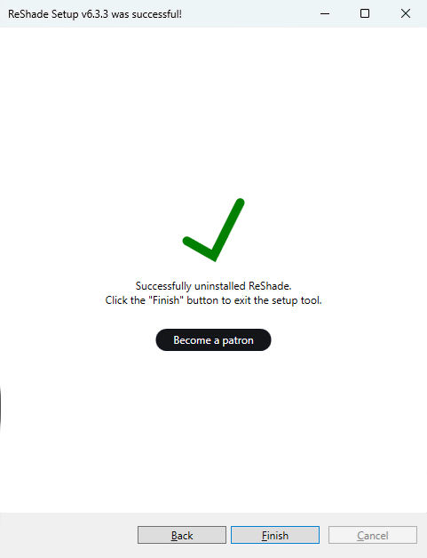

# ReShade Setup Tool

## Use Case
The ReShade Setup Tool makes uninstalling ReShade easy, ensuring you don't delete any game-critical files.

---

## Selecting Your Game
When you open the ReShade Setup Tool, you’ll need to choose the game or application that ReShade is currently installed in.

If your game isn’t listed, click the "Browse..." button at the bottom-right corner of the setup tool. This will open a File Explorer window where you can manually find your game or application's executable file.

Executable files usually have the ".exe" extension and are often located in the main folder of the game’s installation directory.

If you’re unsure where to find your game or application's executable, you can check [our guide on finding your game’s executable and directory](/additionalguides/03findgameexecutable) for a step-by-step walkthrough.

## Selecting the Rendering API
If ReShade is installed, the Rendering API that had been previously selected will be ticked for you. If ReShade is not installed, or you've selected the wrong executable for your game/application, this will be blank.

## Select "Uninstall ReShade and effects"
After you've selected the Rendering API, you'll be given three options. To uninstall ReShade, select the option "Uninstall ReShade and effects".

## Finishing Up
When the ReShade Setup Tool completes the uninstallation process, a confirmation screen will appear. Click the "Finish" button at the bottom-right, then start your game to ensure ReShade is properly uninstalled.

