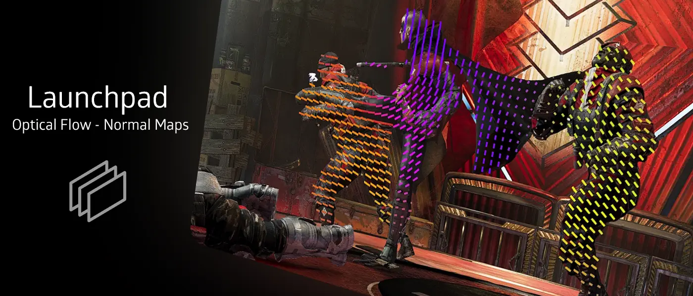
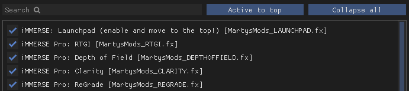
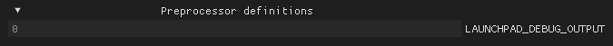
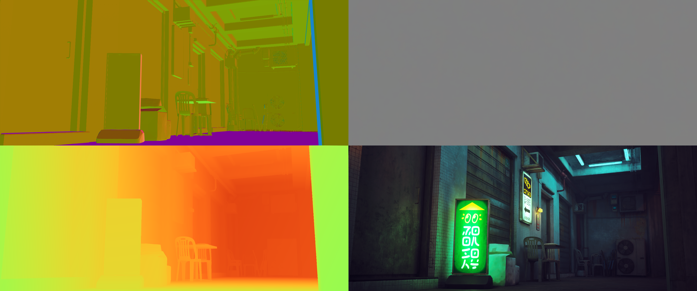
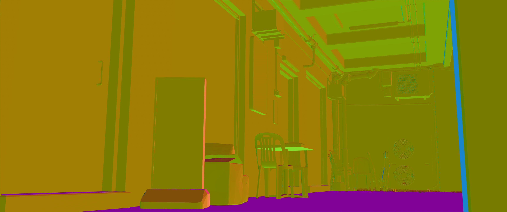
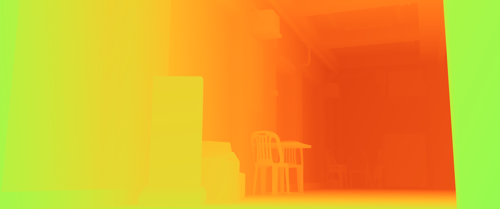

<!------------------------IMPORTS ---------------------------->

import ImageComparisonSlider from '@site/src/components/ImageComparisonSlider';
import ReactPlayer from 'react-player'

<!----------------------------------------------------------->

## Use Case:

iMMERSE: Launchpad is Marty's helper shader designed to import high-quality normals and motion vectors (through Optical Flow) into shaders like MXAO, RTGI, and ReLight.

:::warning
Launchpad is REQUIRED to be at the top of the shader load order in order to function properly.

:::

---

## Video Breakdown:

<ReactPlayer
  url="https://www.youtube.com/watch?v=RhT4MFRQ5jo"
  playing={false}
  muted={false}
  volume="0.20"
  controls={true}
  loop={false}
  width="100%"
  height="100%"
  style={{ 
    display: "block",
    aspectRatio: "16/9",
    margin: "0 auto"
  }}
/>

## Arguments:

### Smoothed Normals
Toggles the shader’s ability to smooth the normals captured by Launchpad, providing softer lighting transitions in shaders like RTGI and ReLight compared to raw normals.

 <ImageComparisonSlider 
  beforeImage="/img/shaders/immerse/images/launchpadnormals.webp" 
  afterImage="/img/shaders/immerse/images/launchpadsmoothednormals.webp"
  beforeLabel="Default Normals"
  afterLabel="Smoothed Normals"
 />

### Textured Normals
Toggles the shader’s ability to add texture details to the normals generated by Launchpad. This feature helps shaders like RTGI and ReLight produce more detailed diffuse and specular lighting. Requires Smoothed Normals to be enabled.

 <ImageComparisonSlider 
  beforeImage="/img/shaders/immerse/images/launchpadsmoothednormals.webp"
  afterImage="/img/shaders/immerse/images/launchpadtexturednormalsmore.webp"
  beforeLabel="Smoothed Normals"
  afterLabel="Textured Normals"
 />

### Textured Normals Sample Radius
Defines how far from the center Launchpad samples for textured normals. A larger radius may introduce artifacts and lower the quality of the normals. A smaller radius typically provides sharper texturing within the normals.

 <ImageComparisonSlider 
  beforeImage="/img/shaders/immerse/images/launchpadtexturednormalsmore.webp"
  afterImage="/img/shaders/immerse/images/launchpadradius.webp"
  beforeLabel="0.000 Radius"
  afterLabel="0.500 Radius"
 />

### Textured Normals Intensity
Controls the strength of the textured normals. High values can result in overly pronounced textures where they shouldn’t appear.

 <ImageComparisonSlider 
  beforeImage="/img/shaders/immerse/images/launchpadtexturednormalsless.webp"
  afterImage="/img/shaders/immerse/images/launchpadtexturednormalsmore.webp"
  beforeLabel="0.100 Intensity"
  afterLabel="0.500 Intensity"
 />

### Textured Normals Quality
Ranges from 1 to 3, determining the overall quality of the textured normals. Setting it to 3 provides the best visuals, though you may need to lower it for performance reasons.

## Debugging:

### LAUNCHPAD_DEBUG_OUTPUT
`LAUNCHPAD_DEBUG_OUTPUT` is a preprocessor definition for Launchpad that provides you with 5 different debug views to see what Launchpad is providing to other shaders. When set to `1`, you will be given a new option in your settings called "Debug Output Modes".

### Debug Output Modes
Provides you with five different visual outputs in order to show you what information Launchpad is passing to other shaders.
- **All**: Displays a 2x2 grid showing normals, optical flow, depth, and the original image.
    
- **Optical Flow**: Visualizes the motion data captured by Launchpad for use by other shaders.
- **Optical Flow Vectors**: Shows the directional flow of motion in greater detail.
- **Normals**: Displays the enhanced normals provided by Launchpad.
    
- **Depth**: Shows the depth map calculated by Launchpad.
    