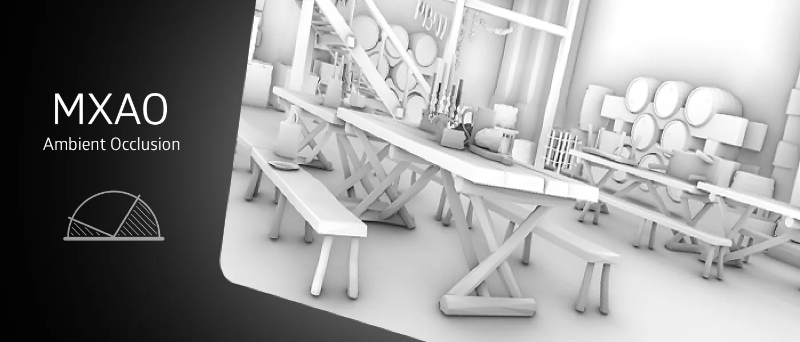
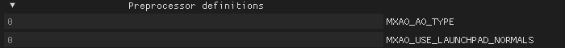
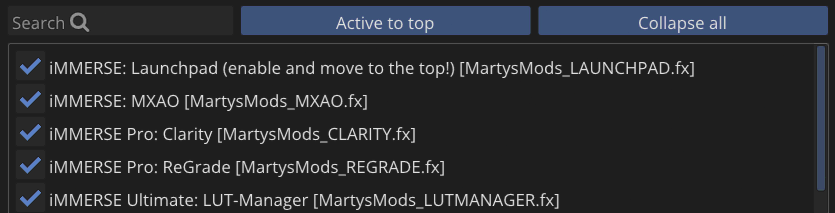
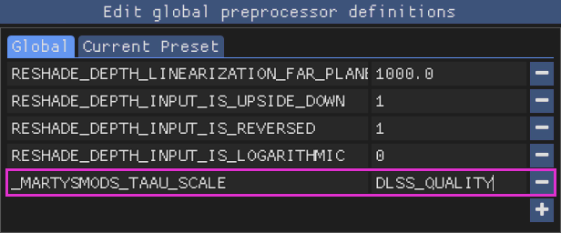

<!------------------------IMPORTS ---------------------------->

import ImageComparisonSlider from '@site/src/components/ImageComparisonSlider';

<!----------------------------------------------------------->

## Use Case:
iMMERSE: MXAO is Marty’s latest take on ambient occlusion, built using GTAO and Irradiance Bitfields for accurate and realistic occlusion-based shading. It’s designed to give you great performance and high-quality visuals without overcomplicating things.

---

## Quality Arguments:

### Sample Quality
Configures the amount of samples that MXAO will generate. Higher values increase quality and detail but reduce performance. Typically you will not need to go past "very high," but larger radius setups might require higher sample quality configurations.

 <ImageComparisonSlider 
  beforeImage="/img/shaders/immerse/images/mxaoqualitylow.webp" 
  afterImage="/img/shaders/immerse/images/mxaoqualityextreme.webp"
  beforeLabel="Low Quality"
  afterLabel="Extreme Quality"
 />

### Shading Rate
Configures the pixel ratio used for MXAO. Full, Half, and Quarter rates will render MXAO at a fraction of the screen resolution. Going lower increases performance, but reduces the quality of MXAO's effect. The difference is most noticeable in motion.

## Radius Arguments:

### Sample Radius
Defines how far MXAO reaches and spreads its shading.

 <ImageComparisonSlider 
  beforeImage="/img/shaders/immerse/images/mxaoradius0.500.webp" 
  afterImage="/img/shaders/immerse/images/mxaoradius3.500.webp"
  beforeLabel="0.500 Radius"
  afterLabel="3.500 Radius"
 />

### Increase Radius with Distance: 
Toggles MXAO's radius scaling based on how far the object is from the screen. Useful for games with a large horizon, but might look odd for far-away buildings or detailed objects.

 <ImageComparisonSlider 
  beforeImage="/img/shaders/immerse/images/mxaodistanceradius.webp" 
  afterImage="/img/shaders/immerse/images/mxaoradius3.500.webp"
  beforeLabel="Disabled"
  afterLabel="Enabled"
 />

## Strength Arguments:

### Ambient Occlusion Amount
Configures the strength of the shadows. Large, close objects should be dark, but avoid excessive shading on leaves and small objects.

<ImageComparisonSlider 
 beforeImage="/img/shaders/immerse/images/mxaointensity0.200.webp" 
 afterImage="/img/shaders/immerse/images/mxaoradius3.500.webp"
 beforeLabel="0.200 Strength"
 afterLabel="1.000 Strength"
/>

### Fade-Out Distance
Defines how far the AO is processed before disappearing. 1.0 is the horizon, and 0.1 is a closer value to the screen. Adjust the Radius to make the scene look correct or to avoid rendering through dense fog.

<ImageComparisonSlider 
 beforeImage="/img/shaders/immerse/images/mxaofadeout0.100.webp" 
 afterImage="/img/shaders/immerse/images/mxaoradius3.500.webp"
 beforeLabel="0.100 Fadeout"
 afterLabel="1.000 Fadeout"
/>

### Filter Quality
Configures the quality of MXAO's filter. Increasing the filter quality will reduce MXAO's banding and noise, providing better filtering and blending. The higher the value, the harsher the performance hit.

## Debugging:

### Show Raw AO
The debug mode of MXAO. This lets you see what each ambient occlusion type does on screen without the distraction of textures and colors.

<ImageComparisonSlider 
 beforeImage="/img/shaders/immerse/images/mxaowithoutdebug.webp" 
 afterImage="/img/shaders/immerse/images/mxaoradius3.500.webp"
 beforeLabel="No Debug"
 afterLabel="Debug"
/>

## Preprocessor Definitions:

### MXAO_AO_TYPE
`MXAO_AO_TYPE` is a preprocessor definition that allows you to change the technique of ambient occlusion provided by MXAO. By default, MXAO uses Ground Truth Ambient Occlusion (GTAO), but you can choose from three other modes:

- **0**: Ground Truth Ambient Occlusion (high contrast, fast)
- **1**: Solid Angle (smoother, fastest)
- **2**: Visibility Bitmask (DX11+ only, highest quality, slower)
- **3**: Visibility Bitmask w/ Solid Angle (like 2, only smoother)

### MXAO_USE_LAUNCHPAD_NORMALS
`MXAO_USE_LAUNCHPAD_NORMALS` is a preprocessor definition that allows MXAO to use Launchpad's higher quality normals. This can also be used to push Launchpad's Smoothed and Textured normals over to MXAO, giving you a much higher quality and natural looking AO in games where the depth buffer is highly polygonal.

## DLSS, FSR, and TAAU Compatibility

### _MARTYSMODS_TAAU_SCALE
:::important
Usage of this preprocessor definition requires Launchpad to be active and above MXAO.

:::
`_MARTYSMODS_TAAU_SCALE` is a **global** preprocessor definition that needs to be added manually. This preprocessor is best used when depth buffer jitter is applied from game scaling techniques such as DLSS, FSR, or TAAU. To make the preprocessor easier, Marty has defined specific modes for users:

| Scaling Mode      | DLSS                     | FSR                     |
| ----------------- | ------------------------ | ----------------------- |
| Native            | `1`                      | `1`                     |
| Quality           | `DLSS_QUALITY`           | `FSR_QUALITY`           |
| Balanced          | `DLSS_BALANCED`          | `FSR_BALANCED`          |
| Performance       | `DLSS_PERFORMANCE`       | `FSR_PERFORMANCE`       |
| Ultra Performance | `DLSS_ULTRA_PERFORMANCE` | `FSR_ULTRA_PERFORMANCE` |