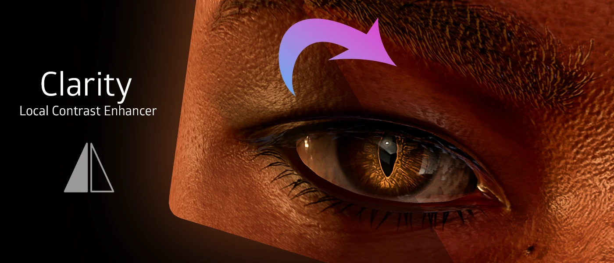

<!------------------------IMPORTS ---------------------------->

import ImageComparisonSlider from '@site/src/components/ImageComparisonSlider';

<!------------------------------------------------------------>

## Use Case:

iMMERSE Pro: Clarity is inspired by Photoshop’s Clarity tool, designed to enhance and restore details in your visuals. It’s particularly useful for bringing out texture and depth in flat or hazy scenes, making it ideal for landscapes, architectural shots, or games with low-contrast lighting. Whether you want to sharpen details in shadows, add definition to mid-tones, or simply make your visuals pop, Clarity provides a versatile way to fine-tune your image without over-sharpening or introducing artifacts.

---

## Blending Arguments:

### Texture Intensity 
Adjusts how much sharpening and detail enhancement is applied. Higher values make textures and details stand out more, but too much can look harsh. Start low and increase gradually until you find the right balance for your scene.

 <ImageComparisonSlider 
  beforeImage="/img/shaders/immersepro/images/clarityoriginal.webp" 
  afterImage="/img/shaders/immersepro/images/claritytexturesharpen.webp"
  beforeLabel="0.000 Texture Sharpen"
  afterLabel="1.000 Texture Sharpen"
 />

### Local Contrast Intensity
Adjusts the contrast between nearby pixels, making details and textures stand out more clearly. Higher values enhance the sharpness and neutralize the lighting of the image. Too much can look harsh, so, start low and increase gradually until you find the right balance for your scene.

 <ImageComparisonSlider 
  beforeImage="/img/shaders/immersepro/images/clarityoriginal.webp" 
  afterImage="/img/shaders/immersepro/images/claritylocalcontrast.webp"
  beforeLabel="0.000 Local Contrast"
  afterLabel="1.000 Local Contrast"
 />

### Effect Radius
Determines how far iMMERSE Pro: Clarity searches around each pixel to apply texture sharpening and local contrast. Higher values emphasize details over a larger area but can create faint halos if pushed too far. Lower values keep the effect subtle and focused but might not stand out as much. If you're unsure, the default value of `0.500` is a safe and balanced starting point.