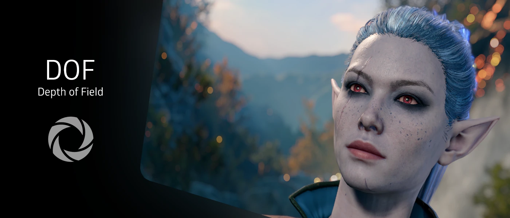

## Use Case:

iMMERSE Pro: Depth of Field is a shader that adds depth of field to a scene. It emulates real-life camera parameters and features, allowing you to focus on specific points or objects, whether macro or micro, to meet your virtual photography needs.

---

## Focusing Arguments:

### Manual Focus
This mode gives you complete control over the focus plane. Perfect for detailed and specific shots, you can precisely control where the camera focuses.

### Autofocus
This mode automatically focuses on the closest object within the focus area. Ideal for dynamic scenes or gameplay where manual adjustment isn't practical.

### Autofocus (Point and Click with MMB [Middle Mouse Button])
This mode lets you set the focus point by clicking with the middle mouse button. It combines ease of use with some manual control, perfect for quickly adjusting focus during virtual photography.

### Enable Focus Helper
This toggles the focus debug mode of the shader. The debug mode provides several on-screen elements to help configure depth of field parameters:
* A dark square for configuring autofocus.
* A green layer representing the background.
* A white layer representing the focal plane.
* A pink layer representing the foreground.

### Autofocus Center
Defines where the camera will focus on the scene. Adjust this if you need to focus on something that isn't in the center of the scene.

### Autofocus Detection Range
Expands or narrows the range of focusing. This is useful for precisely targeting the focal subject.

### Autofocus Adjustment Speed
Determines how responsive the lens/camera is to focus changes. A higher value makes the camera react faster to changes. For gameplay requiring fast movement, it's recommended to keep this at the highest value to avoid distraction from the action.

### `DOF_FULL_RESOLUTION`
Toggles iMMERSE Pro: Depth of Field to use the full screen resolution.