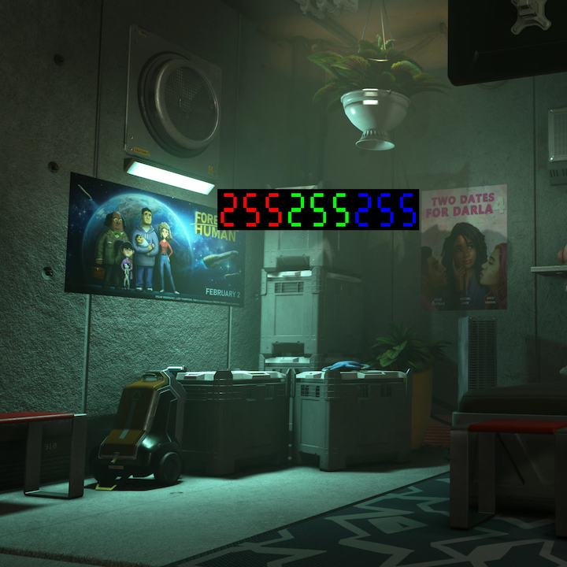
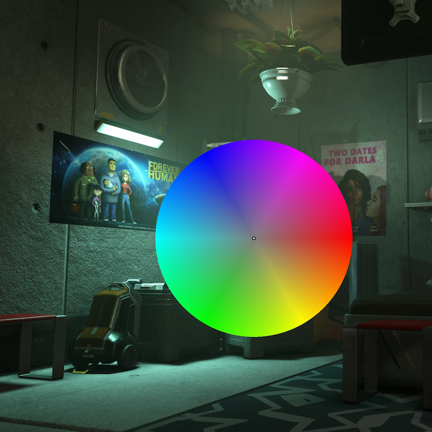
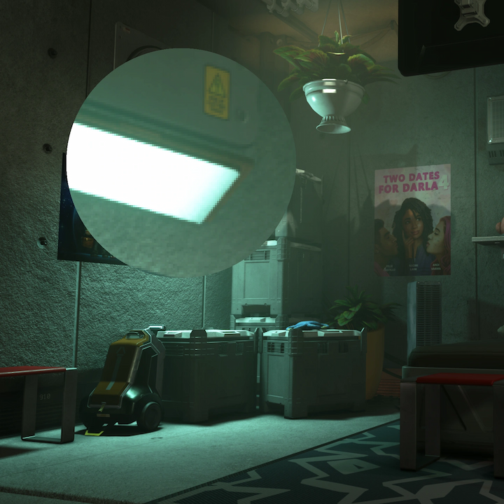
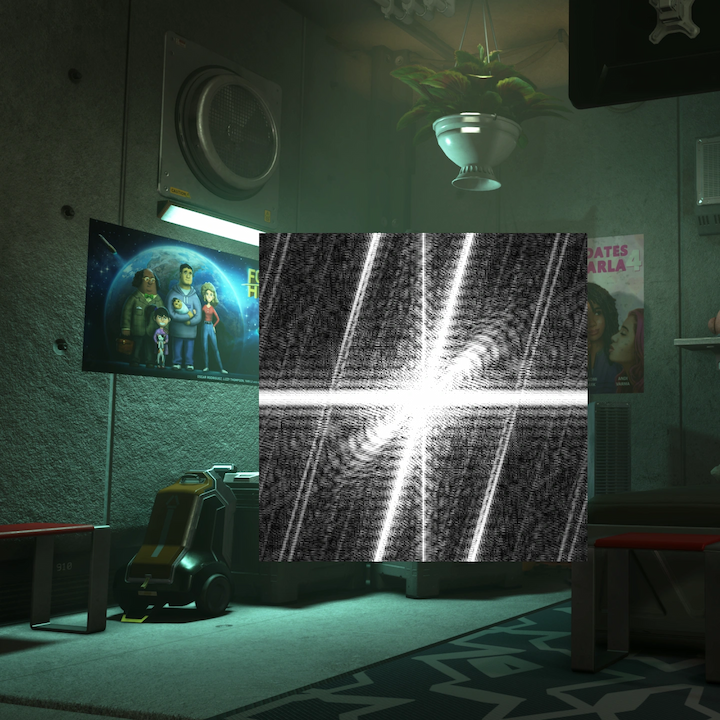

# Insight

iMMERSE Pro: Insight is an image analysis shader designed to help users better understand what is happening on screen. It includes features such as a magnifying glass, image histograms, and tools for checking the RGB values of individual pixels.

---

## Color Parameters:

### **Color Clipping Overlay**
 * **Disabled:** Shows no color based inspection tools on the screen.
 * **Black/White Clipping:** Configures the clipping function to detect black and white values. When enabled, black pixels that are clipping will be displayed as white, and white pixels that are clipping will be displayed as black.

    
 * **RGB Clipping:** Configures the clipping function to check for red, green, and blue values individually. This allows for precise identification of clipping within each color channel.

    

### **Histogram Mode**
 * **Disabled:** Shows no color based inspection tools on the screen.
 * **Luminance Histogram:** The Luminance Histogram displays the brightness levels of the image, allowing you to see the distribution of light and dark areas. This can assist in adjusting exposure and contrast.

    
 * **RGB Histogram:** The RGB Histogram shows the distribution of red, green, and blue color channels across the image. It is essential for identifying color imbalances and ensuring accurate color representation.

    
 * **Luminance Waveform:** The Luminance Waveform represents the brightness levels of the image over time or across the horizontal axis. This is particularly useful for video work, ensuring consistent exposure throughout the image.

    
 * **RGB Waveform:** The RGB Waveform breaks down the image into its red, green, and blue components, showing their respective brightness levels. This is crucial for balancing color across the image and ensuring no channel is dominant.

    
 * **RGB Waveform Parade:** The RGB Waveform Parade displays the red, green, and blue channels separately, side by side. This allows for easy comparison of the individual channels, making it easier to correct color balance issues.

    

## Inspector Parameters:

### Inspector Types
 * **RGB:** Displays the red, green, and blue values for the selected pixel. This is useful for analyzing the exact color composition at a specific point.

   
* **Hue Map:** Shows a map of the hue, color, and luminance values for the selected pixel. This helps in understanding the color relationships within that area.

   
* **Magnifying Glass:**
Provides a zoomed-in view of the selected pixel and its surrounding area, allowing for detailed inspection of image elements.

   
* **FFT:** Performs a Fast Fourier Transform on the selected pixel and its surroundings, offering insights into the frequency components of that area.

   

### Inspector Size
Changes the size of the chosen inspector.

### Use Point and Click (MMB)
Allows you to anchor the chosen inspect where you click middle mouse button.

### Mangifier users Bicubic Interpolation
Configures the Magnifier inspector to filter the scope using a bicubic filter.