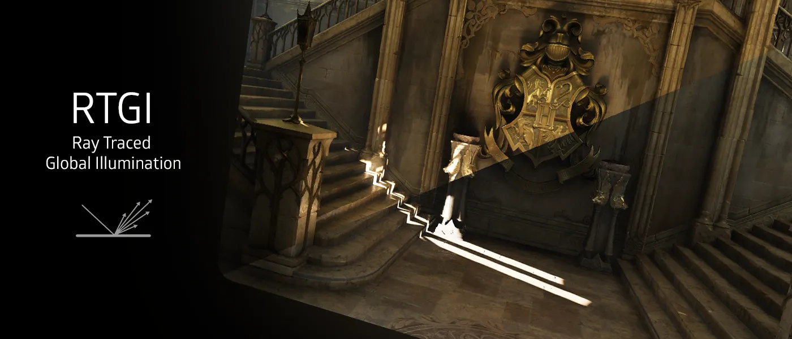
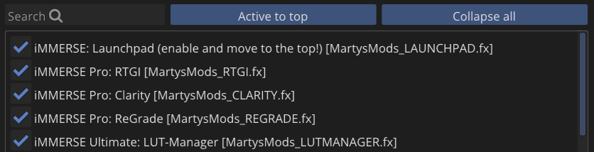

<!------------------------IMPORTS ---------------------------->

import ReactPlayer from 'react-player'

<!----------------------------------------------------------->

## Use Case:

iMMERSE Pro: RTGI is a shader that brings realistic lighting to your games. By using ray tracing, RTGI is able to physically simulate how light interacts with objects in order to enhance details and provide more accurate screen spaced bounce lighting through the means of global illumination and ambient occlusion.

:::warning
Launchpad is REQUIRED to be at the top of the shader load order in order for RTGI to function properly.

:::

---

## Configuring RTGI

### Setting up Z-Thickness  
The first step in configuring RTGI is setting a parameter called Z-Thickness. By default, this value is set to 0.250; however, depending on the game and the relative thickness of objects within its world, this setting might be too high or too low.

A straightforward way to adjust Z-Thickness is to use RTGI’s "Lighting Only" debug view. This view provides an unfiltered look at the lighting, shadows, and ambient occlusion applied to the game world.

With the "Lighting Only" debug view enabled, adjust the Z-Thickness parameter by dragging it up and down, and carefully observe the changes in shadows and ambient occlusion. Keep in mind that it’s easy to overshoot the optimal value. A setting that is too high can cause over-occlusion or haloing, while one that is too low may leave some areas insufficiently occluded.

<ReactPlayer
  url="https://zarith.us/jordan%5C2025_ZARITH-DESKTOP/2025-02-23%2014-41-10%201.webm"
  playing={false}
  muted={true}
  controls={true}
  loop={true}
  width="100%"
  height="100%"
  style={{ width: "100%", margin: "0 auto" }}
/>

### Setting up Intensities

Now that you have your Z-Thickness dialed in where you want it, the next step is to configure your Ambient Occlusion and Bounce Lighting intensities. It's best to do this with the "Lighting Only" debug view disabled, so you can see how RTGI integrates with the scene.

These settings are largely a matter of personal preference, but the goal is to blend them naturally with the environment without making them overbearing.

If you find the scene too dark or not bright enough, try reducing the Ambient Occlusion intensity and increasing the Bounce Lighting intensity. Conversely, if the scene appears overly bright and lacks depth, increase the Ambient Occlusion intensity and decrease the Bounce Lighting intensity.

## Diffuse RTGI:

### Quality
Configures the quality of RTGI's diffuse global illumination. Higher settings cast more rays per pixel and provide more samples per ray, resulting in more stable and detailed lighting. 

## Specular RTGI:

### Quality
Adjusts the quality of RTGI's specular global illumination. Higher settings increase the number of rays cast per pixel and the samples per ray, enhancing light reflections and stability. Having higher surface roughness values will often require higher quality modes in order to remove noise from the image.

### Surface Roughness
Adjusts the roughness value for materials in the scene, with rougher surfaces diffusing more light based reflections while smoother surfaces will reflect more sharper lighting based reflections.

### Specular Lighting Intensity
Sets the strength of the specular global illumination, impacting clarity of reflected light on shiny surfaces.

## Denoiser:

### Quality
Controls the quality of the denoiser. Higher quality denoisers will end up being more performance intense, but will also provide a much more coherent and stable image.

### Smoothness
Controls the smoothness of the denoiser. Lower typically means a more grainy image with higher quality shadows and global illumination, while higher values typically reduce the sharpness of the shading and global illumination in order to provide a much more coherent image. 

## Blending Arguments:

### Ambient Level
Modifies the overall amount of ambient light in the scene, influencing the general brightness and visibility of details. However, this will allow RTGI to increasingly add more raytraced global illumination back into the scene.

### Ambient Sky Intensity
Regulates the intensity of ambient light coming from the sky, contributing to the natural illumination of the scene.

### Fade Out Range
Determines the distance over which RTGI propagates light, affecting how far lighting effects extend within the scene.

## Experimental Arguments:

### Assume sRGB Input
Specifies whether the input to RTGI is in sRGB color space. This setting is particularly useful when playing a game in HDR or providing RTGI with HDR buffers, ensuring accurate color representation and lighting effects.

## Debug Arguments:

### Enable Debug View
Provides the user with two debug views.
* **Disabled:** Standard RTGI output.
* **Validation Layer:** Debug providing visual output of Depth, Lighting, Normal Vectors, and Optical Flow
* **Lighting only:** Standard Lighting Channel Debug

## DLSS, FSR, and TAAU Compatability

### _MARTYSMODS_TAAU_SCALE
`_MARTYSMODS_TAAU_SCALE` is a **global** preprocessor definition that needs to be added manually. This preprocessor is best used when depth buffer jitter is applied from game scaling techniques such as DLSS, FSR, or TAAU. To make the preprocessor easier, Marty has defined specific modes for users:

 
| Scaling Mode Mode | DLSS                     | FSR                     |
| ----------------- | ------------------------ | ----------------------- |
| Native            | `1`                      | `1`                     |
| Quality           | `DLSS_QUALITY`           | `FSR_QUALITY`           |
| Balanced          | `DLSS_BALANCED`          | `FSR_BALANCED`          |
| Performance       | `DLSS_PERFORMANCE`       | `FSR_PERFORMANCE`       |
| Ultra Performance | `DLSS_ULTRA_PERFORMANCE` | `FSR_ULTRA_PERFORMANCE` |