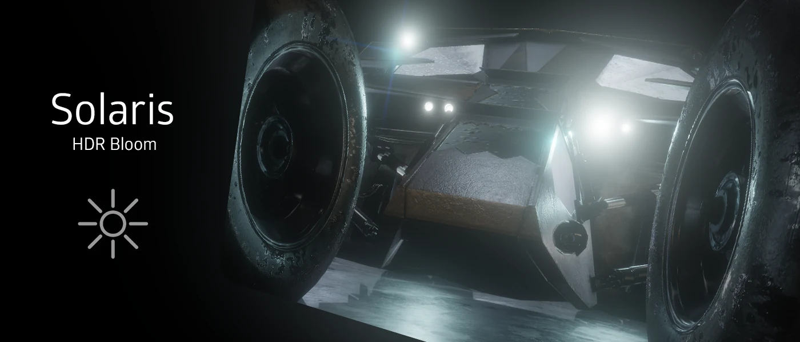

## Use Case:

iMMERSE Pro: Solaris is a physically based exposure and bloom shader that replicates the light that travels to the camera sensor. Solaris was built to generate a bloom that is comparable to real-world photography within your games through HDR reverse-tonemapping in order to create realistic glowing around bright light sources.

---

## Basic Arguments:

### Log Exposure Bias
Adjusts exposure using a logarithmic formula. Increasing this value from 0 doubles the brightness (e.g., 1 results in twice the original exposure, 2 results in four times the original exposure). Decreasing it from 0 halves the brightness.

### Log HDR Whitepoint
Sets the highest whitepoint Solaris will consider for bloom. Lower values cause more bloom in darker areas, while higher values shift bloom towards brighter areas.

### Bloom Intensity
Adjusts the overall strength of the bloom effect. Higher values result in a more pronounced bloom, while lower values produce a subtler effect.

### Bloom Radius
Sets the width of the bloom effect. A larger radius spreads the bloom over a wider area, creating a softer look. 

### Bloom Hazyness
Controls the amount of haze in the bloom effect. Lower values maintain more detail where the bloom appears, while higher values increase haze and reduce clarity.

### High Resolution Input
Enables high-resolution sampling. This is useful for capturing detailed or small objects that need to glow, enhancing the precision of the bloom effect.

### Mask by Depth
Enables depth-based masking in Solaris, allowing the bloom effect to be influenced by the scene's depth information.

### Depth Mask Strength
Adjusts the intensity of depth masking. Higher values apply more depth masking, reducing bloom in distant areas. Lower values apply less depth masking, allowing more bloom throughout the scene.

## Preprocessor Definitions:

### `ENABLE_SOLARIS_REGRADE_PARITY`
ADD TEXT

### `SOLARIS_ARTISTIC_MODE`
ADD TEXT

### SOLARIS_PERF_MODE
Activates a performance-optimized mode for Solaris, reducing computational load. This mode is useful for low-performance setups.